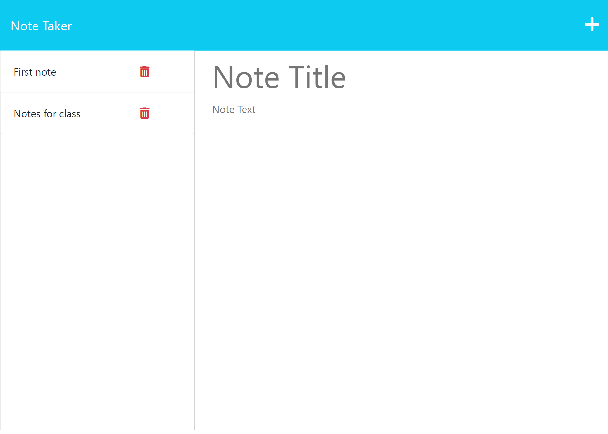

# Note Taker

## Table of Contents
1. [Description](#description)
2. [Installation](#installation)
3. [Usage](#usage)
4. [Contributing](#contributing)
5. [Tests](#tests)
6. [LIcense](#lIcense)

## Description
This application uses Express.js to save and retrieve notes from a JSON file.
## Installation
npm install
## Usage
node server.js
## Contributing
fork, code, pull request
## Tests
npm test
## License
Checkouthttps://mit-license.org/for this project license information.